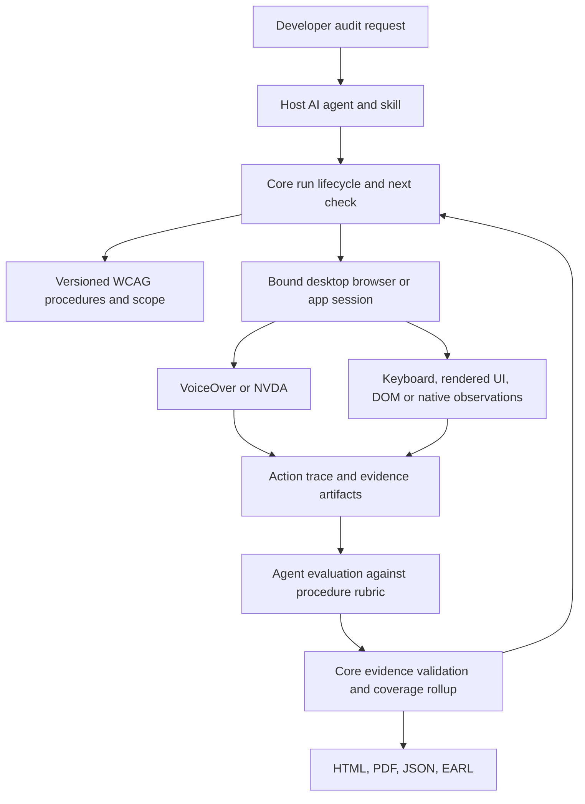

# a11ied agent-led desktop audits: implementation plan (v0.1.0 - 2026-10-01)

## Summary

Make a11ied the tool an AI agent uses to complete an accessibility assessment:
explore the interface, operate the real screen reader, evaluate observed behavior,
preserve evidence, recover from interruptions, and produce a report. The existing
driver, standards corpus, scans, and report renderers are useful foundations.
The largest gaps are criterion outcome correctness and the missing runtime
assessment loop. This plan covers desktop targets only.

Implementation epic: `a11lied-j24`. Review task: `a11lied-n5y`.
Beads owns task status and dependencies. The task grid is a planning snapshot.
This document proposes implementation; it does not claim those changes are complete.

## Objectives and scope

In scope:

- Website audits through the existing macOS VoiceOver, Windows NVDA, and virtual
  targets, with real assistive technology required for claims about reader behavior.
- Existing desktop native-app targets through `a1 sr start --app`. Extend assessment
  and report support around those targets without adding execution platforms.
- WCAG 2.2 Level AA as the default. Preserve the existing WCAG 2.1/2.2 and
  A/AA/AAA selection surfaces; expose procedure coverage for the selected version.
- Keyboard, visual, content, media, and complete-process checks alongside screen
  reader checks. Speech alone cannot assess the whole standard.
- CLI, MCP, Agent Skills, core orchestration, schemas, standards data, reporting,
  installation, evaluation, documentation, marketing, and release evidence.
- Full-site `https://createdbyfireside.com` as the public website example.

Out of scope:

- Mobile devices, mobile operating systems, TalkBack, and iOS execution.
- New screen reader targets, a hosted audit service, or a bundled LLM provider.
- Replacing Playwright, Guidepup, Zod, or the existing report presentation.
  Scanner replacement is conditional on the T-21 license decision.
- A general browser automation product or a configurable workflow framework.
- Unqualified claims that one agent, one reader, or one environment proves universal
  accessibility. Reports must state the scope and actual environment.

## Assumptions and open questions

- The host AI agent supplies reasoning and can inspect supported image artifacts.
  CLI/MCP supply execution, observations, evidence validation, and durable progress.
- A developer's normal entry point is one request to that agent. A standalone CLI
  cannot perform semantic reasoning unless an agent drives the returned work.
- No LLM API key or model-specific SDK is required inside a11ied. The host selects
  its model. Record available agent/model identity in the audit receipt.
- Keep run data in the existing ignored `.a11ied` directory. Reuse atomic JSON
  inventory writes and JSONL evidence; add locking only at actual mutation boundaries.
- Start with a proven Chromium-family browser and the host's real reader.
  Safari/Firefox support must state which observations and controls work together.
  Do not assume Playwright's WebKit build is Safari or shares Safari's signed-in state.
- A single machine validates its local environment. Windows/NVDA and macOS/VoiceOver
  receipts can be combined for one scope through imported, validated environment results.
- Desktop software uses informative WCAG2ICT guidance. Do not label native software
  results as normative web-page WCAG conformance.
- “Complete assessment” means each scoped obligation has sufficient evidence.
  An attempted check with `cantTell` remains unresolved coverage and supports a
  partial report, never a conformance conclusion. A queue emptied with blanket uncertain records
  does not meet the product acceptance gate.

* The maintainer approved retaining axe-core under a narrow MPL-2.0 exception.
  [The dependency policy](../dependency-licenses.md) records its scope and release
  checks. Other dependencies must still meet the general permissive-license policy.

- Default to a full assessment when the user asks for one. Do not ask again about
  scope already supplied.

## Requirements

### Functional requirements

- FR-1: Start a run from a target and an assessment profile. Discover pages,
  functional states, shared components, and complete user journeys.
- FR-2: Generate explicit checks for every selected success criterion. Keep
  undetected features as hypotheses requiring applicability review.
- FR-3: Return the next executable check with setup, required capabilities,
  evidence requirements, expected observations, and recovery guidance.
- FR-4: Operate the intended reader and keyboard in the intended window/document.
  Collect observations from that state without losing authentication or journey progress.
- FR-5: Support agent judgment of semantic requirements. Require evidence and
  rationale, and request missing context only when it affects the result.
- FR-6: Validate evidence and derive coverage, pending work, and outcomes in core.
  Keep failures decisive without promoting partial passes to criterion passes.
- FR-7: Resume after interruption without hand-editing JSON or blindly replaying
  actions that might have submitted data.
- FR-8: Provide the same lifecycle and evidence behavior through CLI and MCP.
  Keep low-level commands available for custom workflows.
- FR-9: Build HTML, PDF, JSON, and EARL in one operation from a run reference.
  Include behavioral and semantic findings alongside scanner findings.
- FR-10: Separate report publication, attempted assessment completion, and
  a qualified conformance conclusion. Disclose unresolved coverage.
- FR-11: Support existing native desktop apps without requiring URLs, DOM trees,
  CSS selectors, or axe results.
- FR-12: Make the installed skill usable outside this repository.

### Non-functional requirements

- NFR-1 (Performance): Reuse a controlled run session, observe deltas, and batch
  safe local work. Avoid repeated full-page loads and full-transcript responses.
- NFR-2 (Safety): Enforce one owner of real reader input per desktop. Validate
  target identity before input. Respect read-only versus authorized QA action scope.
- NFR-3 (Privacy): Keep credentials in local browser state. Redact sensitive typed
  values and artifacts. Explain any artifact capture needed to assess private content.
- NFR-4 (Resilience): Bound every action, wait, retry, discovery frontier, and
  exploration loop. Persist attempts and concrete recovery instructions.
- NFR-5 (Integrity): Version contracts, procedures, environments, and evidence.
  Diagnose invalid artifacts instead of interpreting them as a clean result.
- NFR-6 (Accessibility): Preserve accessible report navigation, headings,
  disclosures, icons, outcome labels, wrapping, and PDF structure.
- NFR-7 (Observability): Distinguish a product failure from an environment failure.
  Save action, observation, judgment, and completion receipts.
- NFR-8 (Language): Preserve original content and speech. Record UI/reader locale.
  Disclose limits in language-dependent role parsing or agent interpretation.
- NFR-9 (Dependencies): Reuse installed libraries. Verify admissible licenses
  before any proposed addition; no new dependency is required by this design.
- NFR-10 (Verification): Test real VoiceOver and NVDA paths. Virtual and mocked
  tests verify logic, not real assistive technology behavior.

## Architecture and design overview

### What the working tree already provides

The uncommitted work improves discovery/resume, run-specific evidence, pending
procedure coverage, real-reader startup failures, draft reports, and report readability.
Keep these changes. The HTML/PDF work includes hierarchical contents, collapsible
criterion tables, outcome badges/counts, wrapping, sticky headings, and PDF outlines.
Rebuilding the presentation would miss the actual product gap.

A live read of the saved Fireside report shows 24 discovered pages and 24 scans,
but zero completed page assessments. It contains 40 axe rule violations, no recorded
hybrid/manual evidence, and 1,049 “not tested” criterion entries. It is a draft.
Its 231 “passed” criterion entries also need reassessment under T-01; the present
rollup can promote partial rule coverage to a whole-criterion pass.

### Confirmed gaps and their consequences

| Gap                                                         | Repository evidence                                                                                                                                                                        | Consequence                                                                                                                                                                   |
| ----------------------------------------------------------- | ------------------------------------------------------------------------------------------------------------------------------------------------------------------------------------------ | ----------------------------------------------------------------------------------------------------------------------------------------------------------------------------- |
| Axe mapping implies complete automation                     | [strategy.ts](../../packages/wcag-data/src/test-methods/strategy.ts), [criteria-rollup.ts](../../packages/core/src/audit/criteria-rollup.ts)                                               | `hasAxe` selects `automated`; one mapped rule pass can produce a criterion pass. Keyboard, alternatives, link purpose, and dynamic names/states remain incompletely assessed. |
| Procedures are identifiers rather than executable guidance  | [strategy.ts](../../packages/wcag-data/src/test-methods/strategy.ts), [wcag.ts](../../packages/contracts/src/schemas/wcag.ts)                                                              | `manual_review` and probe names do not tell an agent which objects, states, or evidence to cover.                                                                             |
| Audit execution ends at scan aggregation                    | [audit/runtime.ts](../../packages/core/src/audit/runtime.ts), [next-commands.ts](../../packages/core/src/audit/next-commands.ts)                                                           | The runtime runs axe/tree/signals and reads saved judgments. It does not run or schedule a complete assessment.                                                               |
| Progress depends on skill-written JSON                      | [full-site-audit/SKILL.md](../../packages/skills/full-site-audit/SKILL.md), [discovery.ts](../../packages/contracts/src/schemas/discovery.ts)                                              | The agent owns phase/page flags without a runtime work queue or state/journey obligations.                                                                                    |
| URLs stand in for functional coverage                       | [discovery/runtime.ts](../../packages/core/src/discovery/runtime.ts), [subject.ts](../../packages/core/src/evidence/subject.ts)                                                            | Open dialogs, invalid forms, user roles, process branches, and hash-routed states do not have adequate assessment identities.                                                 |
| Recorded judgments have weak provenance                     | [evidence.ts](../../packages/contracts/src/schemas/evidence.ts), [criteria.ts](../../packages/core/src/evidence/criteria.ts)                                                               | A required procedure is covered by a matching record without proof of environment, state, transcript, or action trace.                                                        |
| Evidence validation differs across interfaces               | [audit-evidence-actions.ts](../../packages/cli/src/commands/audit-evidence-actions.ts), [evidence.ts](../../packages/mcp-server/src/tools/evidence.ts)                                     | Explicit procedure IDs bypass criterion lookup in CLI; MCP can fall back for unknown criteria. Both can store unsupported claims.                                             |
| Evidence read errors are hidden                             | [store.ts](../../packages/core/src/evidence/store.ts)                                                                                                                                      | Read failures return an empty list; malformed lines disappear. Missing evidence and damaged evidence look alike.                                                              |
| Scan cache keys omit mutable state                          | [axe/runtime.ts](../../packages/core/src/axe/runtime.ts), [shared-browser.ts](../../packages/core/src/browser/shared-browser.ts)                                                           | A long-lived process can reuse URL/version scan results after the UI changes. Custom page setup also reloads separate pages for observations.                                 |
| Reader focus confirmation identifies an app, not a document | [window-focus.ts](../../packages/guidepup/src/window-focus.ts), [context-action.ts](../../packages/core/src/driver/context-action.ts)                                                      | Startup guards do not protect every later action. The same browser process can have the wrong tab or address bar focused.                                                     |
| Driver capabilities overstate support                       | [adapter-shared.ts](../../packages/guidepup/src/adapter-shared.ts), [adapters.ts](../../packages/guidepup/src/adapters.ts)                                                                 | All action names are advertised even where an adapter rejects an action, such as NVDA cursor screenshots.                                                                     |
| A repeated phrase can be mistaken for the end               | [broker-loops.ts](../../packages/core/src/driver/broker-loops.ts), [adapters.ts](../../packages/guidepup/src/adapters.ts)                                                                  | Real position tokens use phrase/item text. Two different controls with the same text can truncate navigation.                                                                 |
| Observation errors can look like empty output               | [adapter-shared.ts](../../packages/guidepup/src/adapter-shared.ts)                                                                                                                         | Failed speech/item reads are caught as empty strings/lists, weakening a judgment about silence or missing announcements.                                                      |
| Findings are primarily axe-shaped                           | [report.ts](../../packages/contracts/src/schemas/report.ts), [aggregate.ts](../../packages/core/src/report/aggregate.ts)                                                                   | The primary findings list is built only from axe violations; agent/reader judgments are stored separately.                                                                    |
| Final report readiness checks too little                    | [readiness.ts](../../packages/core/src/report/readiness.ts), [aggregate.ts](../../packages/core/src/report/aggregate.ts)                                                                   | A nonempty criteria list and no pending flags do not prove the selected criterion set, state coverage, or environment was assessed. Audit result validation is shallow.       |
| Native apps stop at the driver                              | [targets/parse.ts](../../packages/core/src/targets/parse.ts), [report.ts](../../packages/contracts/src/schemas/report.ts)                                                                  | The driver accepts apps, but assessment/evidence/report flows expect web documents, URLs, and selectors.                                                                      |
| MCP parity is mostly command presence                       | [registry-parity.test.ts](../../packages/mcp-server/src/registry-parity.test.ts)                                                                                                           | Matching names do not guarantee the same validation, execution, defaults, recovery, or evidence behavior.                                                                     |
| Repository MCP launch configuration is malformed            | [.mcp.json](../../.mcp.json)                                                                                                                                                               | The a11ied entry puts an executable and `mcp` argument in one `command` string instead of separate command/args fields.                                                       |
| Marketing and skills promise the wrong boundary             | [index.astro](../../packages/docs/src/pages/index.astro), [test-methods.astro](../../packages/docs/src/pages/test-methods.astro), [a11ied/SKILL.md](../../packages/skills/a11ied/SKILL.md) | Component/scan loops dominate. “No manual verification is needed” and “axe rules decide the criterion” overstate what scans establish.                                        |
| Tests prove smaller operations                              | [smoke-screen-reader.mjs](../../scripts/smoke-screen-reader.mjs), [screen-readers.yml](../../.github/workflows/screen-readers.yml)                                                         | The real-reader smoke test proves a heading was announced, not that an agent discovered and assessed a complete interaction process.                                          |

These are source/artifact findings, not newly reproduced live desktop failures.
No real reader was started during this planning review.

### Proposed developer experience

A developer asks the installed agent:

> Audit https://createdbyfireside.com against WCAG 2.2 AA. Cover the whole site,
> use the real desktop screen reader, and give me the report.

The agent starts one run, handles required sign-in or action authorization once,
then continues the assessment until completion or specific blockers.
The developer does not coordinate page workers, file paths, or pending procedures.

Proposed CLI surface, to be implemented:

```sh
a1 audit run https://createdbyfireside.com --scope site --level AA --wcag 2.2
a1 audit next --run <run-id>
a1 audit status --run <run-id>
a1 audit resume --run <run-id>
a1 report build --run <run-id>
```

Keep `audit record` and `sr` as the action/evidence surfaces, extended with run/check
references. Reuse the existing `report build` command for finalization rather than
adding a second report command. `--draft` continues to build a preview.

The initial `audit run` performs available setup/discovery/scans and returns structured
work for the host agent. It must not label a standalone scan as a completed agent audit.
MCP exposes the same core operations. A report operation derives artifact paths from
the run; no repeated inventory/results/evidence path wiring is needed.

### Execution and data ownership



Keep responsibilities explicit:

- The runtime owns identities, work status, validation, retries, and report generation.
- The agent discovers meaningful behavior and evaluates requirements from evidence.
- A procedure defines the required observations and limits of a conclusion.
- The driver executes actions and reports facts; it does not invent WCAG outcomes.
- The report presents validated findings, coverage, and unresolved results.
- A human supplies context, authorization, or expert review when the available
  tools and agent cannot support a conclusion.

Use the existing package boundaries:

| Area                               | Planned responsibility                                                                             |
| ---------------------------------- | -------------------------------------------------------------------------------------------------- |
| `packages/contracts`               | Versioned run/state/journey/check/evidence/finding schemas and migrations.                         |
| `packages/wcag-data`               | Normative source provenance and curated procedure catalog; correct partial rule mappings.          |
| `packages/wcag-engine`             | Existing queries plus procedure retrieval and applicability guidance.                              |
| `packages/guidepup`                | Real-reader capabilities, target/cursor observations, input execution, and adapter diagnostics.    |
| `packages/core`                    | Run lifecycle, session ownership, discovery, probes, evidence validation, coverage, and rendering. |
| `packages/cli`                     | Thin lifecycle/action wrappers, concise progress, structured output, and reliable exit behavior.   |
| `packages/mcp-server`              | The same operations with bounded responses and consistent validation.                              |
| `packages/earl`                    | Preserve assertion provenance and distinct rule/procedure/criterion outcomes.                      |
| `packages/skills`                  | Host-agent assessment loop and task-specific progressive guidance.                                 |
| `packages/act-conformance`         | Keep deterministic rule validation; add behavioral evidence tests elsewhere.                       |
| `packages/docs`, `README.md`       | Evidence-backed product story, installation, tasks, limitations, and examples.                     |
| `.github`, `scripts`, release docs | Real desktop fixtures, clean-install gates, and versioned proof receipts.                          |

### Minimal contract changes

Extend existing contracts; use new files only where the present module would mix
unrelated responsibilities.

- Run: target, WCAG version/level, audit scope, approved action policy, environments,
  discovered states/journeys, selected checks, blockers, and lifecycle status.
- State: target/page or app screen identity, observed UI state, environment,
  setup trace, related journey, and observation completeness.
- Check: procedure/version, scope unit, required capabilities, status, attempts,
  evidence references, outcome, and unresolved reason.
- Evidence: run/check/state/environment references, real/simulated source,
  action/checkpoint ranges, timestamps, artifacts, actor, rationale, and freshness.
- Finding: source and test identity, criterion obligations, user impact,
  state/journey location, reproduction, remediation, and evidence references.
- Report: selected profile, assessment coverage, attempted checks, blockers,
  tested environments, methodology, findings, and qualified conclusion.

Treat an accessibility-tree hash as one freshness signal. It cannot establish
unchanged contrast, visibility, interaction behavior, video content, or authentication.
Bind evidence to observed state and relevant artifact/procedure versions.

Use runtime schemas to validate complete audit files. Do not accept a few array
properties as proof that an `AuditReport` has the required shape.

### Outcome and completion rules

1. Keep scanner rule outcomes scoped to their checks.
2. Map confirmed rule failures to applicable criterion obligations.
3. Require every applicable obligation in the scoped state/process set before a
   criterion passes. Do not make every shared component check run on every page.
4. Reuse shared-component evidence only for demonstrated equivalent behavior,
   state, environment, and procedure. Keep scope exceptions and recheck variants.
5. Require an applicability rationale for `inapplicable`. “Not detected” is insufficient.
6. Preserve incomplete scans, unsupported capabilities, and uncertain judgments
   as unresolved outcomes. Record what was attempted and what evidence is missing.
7. Publish a final report with unresolved results when appropriate, but mark the
   assessment conclusion accordingly. Do not equate “file generated” with conformance.
8. Refuse a conformance conclusion when scoped criteria, full pages, complete
   processes, accessibility support, or non-interference remain unresolved.
9. Record desktop viewport limits. A desktop-only assessment cannot establish
   untested responsive/mobile variations of a web page.

### Why existing libraries are enough

Playwright already supplies headed contexts, keyboard input, screenshots, locators,
frames, and DOM observations. Guidepup supplies VoiceOver/NVDA control and speech.
Zod supplies runtime contracts. Node supplies durable files and process coordination.
The report renderer already supplies presentation and print export.

The lockfile confirms Playwright 1.62.1 (Apache-2.0), Guidepup 0.33.2 (MIT), virtual
screen reader 0.32.1 (MIT), Zod 4.4.3 (MIT), and MCP SDK 1.30.0 (MIT).
It also identifies axe-core 4.13.0 as MPL-2.0. The maintainer approved the exception
recorded in [the dependency policy](../dependency-licenses.md) for T-21.

The missing work is assessment orchestration and evidence semantics. Adding another
scanner or browser library would not close those gaps. Any scanner replacement under
T-21 addresses license policy, not the assessment architecture. Reuse existing actions,
assertions, checkpoints, APG queries, and report helpers.

### Implementation order and gates

- Gate A: Correct misleading pass/coverage claims and protect desktop input.
  Start T-01, T-03, T-05, and T-17.
- Gate B: Deliver one complete vertical workflow before broad probe expansion.
  Use a dialog/form/status-message fixture: discover the state, drive a real reader,
  capture evidence, judge it, interrupt/resume, and report the finding.
  Implement the minimal required slices of T-02, T-04, T-06, T-07, T-08,
  T-10, T-14, T-15, and T-16.
- Gate C: Expand procedure and state/journey coverage. Finish keyboard/visual/content
  probes, uncertainty handling, resilient recovery, and existing desktop app reports.
- Gate D: Evaluate complete workflows on both real desktop readers from packed installs.
  Use T-19/T-20 receipts before T-18 broadens the product claims.

Beads dependencies describe completion prerequisites. They do not require finishing
an entire procedure catalog before testing the first end-to-end path.

### Source references checked for this review

- [WCAG 2.2 conformance requirements](https://www.w3.org/TR/WCAG22/#conformance-reqs):
  full pages, complete processes, accessibility-supported technology, and non-interference.
- [WCAG-EM 1.0](https://www.w3.org/TR/2014/NOTE-WCAG-EM-20140710/):
  informative evaluation methodology, including functional exploration and sampling.
  Pin the stable Note for methodology; do not silently substitute the evolving
  document at the latest-version URL.
- [WCAG2ICT Note](https://www.w3.org/TR/2025/NOTE-wcag2ict-22-20251211/):
  informative application to non-web software; it does not create normative web conformance.
- [Guidepup](https://github.com/guidepup/guidepup):
  the existing automation dependency supports macOS VoiceOver and Windows NVDA.
  The lockfile resolves version `0.33.2`; verify the release version during implementation.
- [Installed Playwright API](https://playwright.dev/docs/api/class-browsercontext):
  the lockfile resolves version `1.62.1`. Reuse it for same-session
  observations, then prove browser/reader combinations on actual hosts.

## Task grid

Beads is authoritative for task status. Claim a Bead before changing production code.

| Status | Task / Bead           | Change                                                                   | Priority | Depends on                                     | Acceptance criteria                                                                                                                                                                                                                                                                                                                                           |
| ------ | --------------------- | ------------------------------------------------------------------------ | -------- | ---------------------------------------------- | ------------------------------------------------------------------------------------------------------------------------------------------------------------------------------------------------------------------------------------------------------------------------------------------------------------------------------------------------------------- |
| [ ]    | T-01 / a11lied-j24.1  | Stop treating scanner passes as whole-criterion passes                   | P0       | None                                           | A clean axe run cannot pass Keyboard, Non-text Content, Link Purpose, or Name Role Value by itself. All incomplete rule results remain unresolved. Shared outcome rules produce consistent CLI, JSON, HTML, PDF, and EARL results.                                                                                                                            |
| [ ]    | T-02 / a11lied-j24.2  | Define executable WCAG assessment procedures                             | P1       | T-01                                           | Every criterion at a requested supported level has explicit procedures or an explicit unresolved coverage gap. Procedures can be retrieved through existing WCAG queries. A procedure states what would justify pass, fail, inapplicable, or uncertain.                                                                                                       |
| [ ]    | T-03 / a11lied-j24.3  | Model durable audit runs, states, journeys, and coverage                 | P1       | None                                           | Same-URL states and multi-page journeys have distinct identities. Target/version/level/environment are persisted. Atomic validated transitions survive restart. Coverage is derived from scoped obligations, not an agent-written audited flag.                                                                                                               |
| [ ]    | T-04 / a11lied-j24.4  | Require traceable and current assessment evidence                        | P0       | T-02, T-03, a11lied-j24.53                     | A note alone cannot complete a required behavioral check. Invalid procedures, stale state evidence, simulated output for real-reader checks, cross-run evidence, missing artifacts, and unqualified inapplicability cannot produce a verified pass.                                                                                                           |
| [ ]    | T-05 / a11lied-j24.5  | Operate native readers with observed target checks and recovery          | P0       | a11lied-j24.53                                 | Native sessions navigate, type, and activate with foreground checks and recovery. Observed mismatch refuses input; typing stops between characters on observed changes. Fresh timestamped state and bounded speech feedback support the agent. Desktop ownership serializes toolkit sessions. Observation limits and residual dispatch races remain explicit. |
| [ ]    | T-06 / a11lied-j24.6  | Keep browser scans and screen-reader checks in one observed session      | P1       | T-03, T-05                                     | Scans, screenshots, tree observations, and reader evidence identify the same state and authentication context. A changed same-URL UI produces fresh scan results. A probe does not reload away a dialog or completed journey step. No secrets are printed or embedded in artifacts.                                                                           |
| [ ]    | T-07 / a11lied-j24.7  | Return accurate driver capabilities and bounded observations             | P1       | a11lied-j24.54                                 | NVDA does not advertise unsupported cursor screenshots. Duplicate labels do not silently truncate a walk. Observation failures cannot become successful silence. Responses can return deltas without repeating the full session transcript, and bounded loop stops disclose uncertainty.                                                                      |
| [ ]    | T-08 / a11lied-j24.8  | Implement a resumable assessment queue and lifecycle                     | P1       | T-02, T-03, T-04                               | A host agent can continue from the next unfinished obligation without editing JSON. Termination after any step resumes without losing evidence or replaying completed side effects. Finalization rejects missing or mismatched scoped coverage. Partial reports remain available.                                                                             |
| [ ]    | T-09 / a11lied-j24.9  | Discover interaction states and complete user journeys                   | P1       | T-06, T-08                                     | The inventory includes same-URL states and cross-page journeys. A sitemap alone cannot declare interaction coverage complete. Canonical hints or identical layouts cannot merge different behaviors. Sampled reports identify tested variants and never extrapolate an untested page to passed.                                                               |
| [ ]    | T-10 / a11lied-j24.10 | Compose keyboard, real-reader, and visual assessment probes              | P1       | T-02, T-06, T-07, T-08                         | Real desktop fixtures with known failures are detected through user-like actions. Screen-reader cursor navigation is not confused with keyboard focus. Probes capture before/action/after evidence, reset safely, and disclose unsupported visual/media measurements instead of claiming passes.                                                              |
| [ ]    | T-11 / a11lied-j24.11 | Guide agent judgments and route unresolved checks                        | P1       | T-02, T-04, T-08                               | An agent can evaluate non-deterministic requirements without changing them into scanner heuristics. Missing context, inaccessible media, or unsupported modalities remain unresolved. The runtime validates evidence requirements without claiming it can mechanically prove the agent's semantic judgment.                                                   |
| [ ]    | T-12 / a11lied-j24.12 | Recover from environment and interaction failures safely                 | P1       | T-05, T-06, T-07, T-08                         | Browser crash, reader loss, auth expiry, focus theft, permission denial, infinite navigation, and corrupt evidence have explicit recovery or blockers. Non-idempotent submissions are never retried blindly. Site instructions cannot alter the run policy or forge results.                                                                                  |
| [ ]    | T-13 / a11lied-j24.13 | Support assessment evidence and reports for existing desktop app targets | P2       | T-02, T-03, T-04, T-05, T-07, T-08             | A macOS or Windows desktop app can have screens/states/journeys, evidence, blockers, and the standard report bundle. Report identity does not require a URL or CSS selector. Missing native capabilities are explicit. No Playwright DOM scan is attempted against a native app.                                                                              |
| [ ]    | T-14 / a11lied-j24.14 | Report behavioral and agent findings with honest coverage                | P1       | T-01, T-03, T-04, T-08                         | A reader can see a keyboard trap, unannounced dialog, or poor alternative text as a primary finding. HTML/PDF/JSON/EARL agree on outcomes and provenance. Missing checks, blocked journeys, partial discovery, sampled pages, and environment limits prevent an unqualified conformance claim.                                                                |
| [ ]    | T-15 / a11lied-j24.15 | Expose the complete audit lifecycle through CLI and MCP                  | P1       | T-05, T-06, T-07, T-08, T-14                   | One agent request can drive an audit and produce its report through either surface. CLI and MCP return the same next obligation, evidence validation, recovery outcome, and final coverage. Standalone CLI output clearly requests agent judgment when needed instead of presenting a scan as a complete assessment.                                          |
| [ ]    | T-16 / a11lied-j24.16 | Rewrite skills around the runtime assessment loop                        | P1       | T-02, T-08, T-09, T-10, T-11, T-12, T-14, T-15 | A skill-driven agent continues beyond the scanner stage, handles interrupts, and builds the report without hand-editing inventories. It cannot satisfy pending checks by blanket cantTell records. It saves specific blockers after real attempts and does not repeat questions already answered.                                                             |
| [ ]    | T-17 / a11lied-j24.17 | Make clean-install agent setup and diagnostics reliable                  | P1       | None                                           | A fresh editor can start the stdio server using a valid executable and separate args. Scans do not demand unrelated reader or recording setup. Real audit mode identifies missing capabilities precisely. Packed installs load both skills and every required runtime artifact.                                                                               |
| [ ]    | T-18 / a11lied-j24.20 | Center marketing and documentation on agent-led desktop audits           | P2       | T-20                                           | The main example shows discovery, interaction, real reader evidence, agent evaluation, recovery, and report generation. Every marketing capability is backed by a release receipt. Static scans and virtual development loops remain documented with accurate scope; mobile execution is not advertised.                                                      |
| [ ]    | T-19 / a11lied-j24.18 | Build an audit evaluation corpus across desktop targets                  | P1       | T-10, T-11, T-12, T-13, T-14, T-15, T-16, T-17 | The evaluation distinguishes action execution, evidence capture, judgment accuracy, coverage, unsupported cases, and recovery. VoiceOver and NVDA have real transcript receipts. Virtual success is never counted as real AT proof. Agent version and variability are recorded; no arbitrary test-count or code-coverage proxy is used.                       |
| [ ]    | T-20 / a11lied-j24.19 | Verify installed desktop audits before declaring product completion      | P1       | T-19, T-21                                     | A developer can ask an installed agent to audit a target and receive evidence-backed reports without repository knowledge or manual file wiring. All scoped requirements are addressed or explicitly blocked after attempts. Real platform receipts, judgment evaluation, fresh Fireside artifacts, and unresolved limitations are documented.                |
| [ ]    | T-21 / a11lied-j24.21 | Resolve axe-core license policy conflict                                 | P1       | None                                           | The maintainer decision is recorded; release requirements enforce it. Replacement, if selected, has an admissible license and an impact/coverage assessment before implementation.                                                                                                                                                                            |

## Task details

### T-01 - Stop treating scanner passes as whole-criterion passes

Bead: `a11lied-j24.1`.

Correct strategy generation, rollups, EARL, and misleading coverage copy. Axe/ACT mappings describe partial rule coverage. Require evidence for the remaining normative obligations before a WCAG criterion can pass. Preserve confirmed failures and incomplete scan results.

Affected areas: WCAG data strategy/build artifacts; core audit/evidence/report rollups; EARL; current test-method copy.

1. Change strategy generation to describe mapped rule coverage without claiming a whole success criterion is automated.
2. Add required obligations for the parts those rules cannot establish. Preserve axe incomplete results as evidence requiring evaluation.
3. Use one core outcome evaluator for audit rollups, reports, and EARL; keep rule-level assertions distinct from criterion assessments.
4. Correct the existing skills and test-method marketing claims immediately. Reassess saved reports instead of carrying forward their criterion passes.
5. Add regressions where axe passes while a keyboard task fails, an image alternative is misleading, or a dynamic widget fails to announce state.

Acceptance: A clean axe run cannot pass Keyboard, Non-text Content, Link Purpose, or Name Role Value by itself. All incomplete rule results remain unresolved. Shared outcome rules produce consistent CLI, JSON, HTML, PDF, and EARL results.

### T-02 - Define executable WCAG assessment procedures

Bead: `a11lied-j24.2`.

Replace opaque procedure IDs and generic manual_review fallbacks with versioned procedures that explain applicability, required capabilities, setup, actions, evidence, evaluation, recovery, and limitations. Cover current WCAG versions and levels; deliver WCAG 2.2 AA first. Keep normative requirements separate from informative techniques and APG examples.

Affected areas: contracts WCAG schemas; wcag-data/test-methods and curated procedure resources; wcag-engine; existing knowledge commands/tools.

1. Extend the existing strategy artifact with procedure definitions, source references, procedure version, applicability, setup, action guidance, evidence requirements, and evaluation rubric.
2. Specify required capabilities explicitly: rendered UI, keyboard, real reader, DOM/native observations, image/audio interpretation, or product context.
3. Define scope per procedure: site, journey, state, component, or element. Keep informative techniques and APG examples separate from normative obligations.
4. Curate WCAG 2.2 AA first; publish a catalog completeness check for every currently selectable version/level.
5. Retrieve procedures through the existing WCAG engine and CLI/MCP queries. Expose missing coverage as a blocker.

Acceptance: Every criterion at a requested supported level has explicit procedures or an explicit unresolved coverage gap. Procedures can be retrieved through existing WCAG queries. A procedure states what would justify pass, fail, inapplicable, or uncertain.

### T-03 - Model durable audit runs, states, journeys, and coverage

Bead: `a11lied-j24.3`.

Extend current Zod run/inventory contracts with desktop targets, observed states, journeys, scoped checks, selected environments, work statuses, and coverage obligations. Reuse current JSON and JSONL storage; do not add a workflow framework. Separate attempted checks, completed assessments, and conformance.

Affected areas: contracts discovery/report/target schemas; core discovery/inventory and new audit run store.

1. Extend the existing inventory/run schema with desktop targets, profile, environments, states, journeys, scoped checks, and action policy.
2. Define explicit transitions for queued, running, evaluated, blocked, unsupported, and stale work; keep assessment outcome separate.
3. Store artifacts under the existing run directory and reference stable IDs rather than requiring callers to assemble paths.
4. Validate and atomically save transitions in shared core operations. Migrate existing inventories without inventing evidence for them.
5. Test restart after each transition, same-URL states, cross-page journeys, and incompatible run/profile/environment imports.

Acceptance: Same-URL states and multi-page journeys have distinct identities. Target/version/level/environment are persisted. Atomic validated transitions survive restart. Coverage is derived from scoped obligations, not an agent-written audited flag.

### T-04 - Require traceable and current assessment evidence

Bead: `a11lied-j24.4`.

Record evidence against a run, state, procedure version, environment, action trace, and referenced artifacts. Validate procedure/criterion combinations in shared core code. Reuse transcript checkpoints. Reject unsupported pass claims; preserve uncertain imported legacy records without treating them as complete. Report corrupt or inaccessible evidence instead of silently returning an empty assessment.

Affected areas: contracts evidence; core evidence/store/criteria and recording validation; CLI audit-evidence; MCP evidence.

1. Extend the evidence schema with run/check/state/procedure/environment references, actor, source, action/checkpoint ranges, artifacts, rationale, and freshness.
2. Distinguish who judged a result from how evidence was collected. An unattended agent judgment is not human manual review.
3. Validate criterion/procedure IDs and evidence requirements in core; route CLI and MCP recording through that function.
4. Keep legacy records readable as unverified imports. Report invalid lines, inaccessible files, and missing referenced artifacts.
5. Test note-only passes, invented IDs, stale visual evidence, virtual-for-real substitutions, unreasoned inapplicability, and conflicts across states.

Acceptance: A note alone cannot complete a required behavioral check. Invalid procedures, stale state evidence, simulated output for real-reader checks, cross-run evidence, missing artifacts, and unqualified inapplicability cannot produce a verified pass.

### T-05 - Operate native readers with observed target checks and recovery

Bead: `a11lied-j24.5`; adaptive implementation: `a11lied-j24.53`.

The host agent controls VoiceOver or NVDA, observes its current item and speech,
queries available focus/foreground state, chooses a bounded action, and inspects
fresh state to verify the effect. Missing authoritative cursor identity is a
reported observation limit. It must not disable ordinary native auditing.

1. Default native sessions to `guarded`. Check observed foreground identity
   before commands and between typed characters. Refuse observed mismatches.
   An explicit focus operation establishes the next intended target.
2. Return timestamped state, available foreground/focus/current-item observations,
   and bounded transcript queries. Preserve speech streaming and checkpoints so
   delayed announcements are available without replaying actions.
3. Report partial or uncertain delivery. Do not automatically retry activation,
   submissions, or typing after an uncertain result. Inspect state before recovery.
4. Retain one native desktop lease and session ownership across CLI, MCP, library,
   and broker paths. A real audit must not silently substitute a virtual reader.
5. Accept native evidence with real-session identity, captured speech, matching
   action/artifact provenance, and explicit observation limits. Evidence integrity
   validation does not mechanically prove the agent's WCAG judgment.
6. Keep `require-binding` as an optional strict gate and `development` as an explicit
   target-check bypass. Document residual focus races in guarded operation.

Acceptance includes a real VoiceOver adaptive workflow, observed wrong-app and
explicit-window rejection, typing interruption, post-action feedback and recovery.
NVDA source/mocked checks are separate from Windows runtime acceptance, which
remains in the platform evaluation and installed-workflow beads.

[Provider research](a11ied-native-control-provider-research.md) records supported
platform primitives and their limits. Missing atomic OS isolation is not an
ordinary-audit prerequisite. The user confirmed this scope on 2026-10-02.

### T-06 - Keep browser scans and screen-reader checks in one observed session

Bead: `a11lied-j24.6`.

Use existing Playwright and Guidepup helpers to keep a controlled headed browser/tab and authenticated context for each run. Scan and inspect the current state without resetting the journey. Bound or remove URL-only scan caching for mutable targets. Preserve manual sign-in for session-storage, MFA, and SSO cases.

Affected areas: core browser/shared-browser/page-setup, driver/browser-launch, axe/runtime, tree/runtime, and session context.

1. Extend the existing browser/session helpers to retain a headed run context and identify its current tab/document.
2. Reuse signed-in state and support interactive login in that controlled session. Keep an explicit fallback for environments that cannot attach.
3. Add same-state scan/tree/screenshot observations. Avoid separate fresh-page loads that reset widgets or process progress.
4. Remove or bound URL-only mutable scan caching; key any retained reuse to the observed state/version and explicit freshness policy.
5. Test authentication, dialogs, same-URL UI changes, navigation, redirects, and readers using a browser that lacks compatible DOM inspection.

Acceptance: Scans, screenshots, tree observations, and reader evidence identify the same state and authentication context. A changed same-URL UI produces fresh scan results. A probe does not reload away a dialog or completed journey step. No secrets are printed or embedded in artifacts.

### T-07 - Return accurate driver capabilities and bounded observations

Bead: `a11lied-j24.7`.

Describe capabilities per target instead of advertising every action for every adapter. Return target identity, keyboard focus, reader cursor, speech deltas, completeness, and observation errors. Prevent identical spoken names from proving end-of-document. Support bounded navigation and expose language/reader verbosity limitations.

Affected areas: guidepup adapters/adapter-shared/current-item; core broker-loops/transcript/broker responses; driver contracts.

1. Declare supported observations/actions per adapter and environment rather than copying every action name into capabilities.
2. Return separate keyboard focus, reader cursor, target identity, announcement deltas, and observation completeness.
3. Replace phrase equality as proof of reader position/end with reliable position information where available; report uncertainty elsewhere.
4. Preserve observation errors and truncation. Expose bounded response selection and checkpoints using existing transcript helpers.
5. Test duplicate accessible names, speech failures, unsupported NVDA screenshots, locale variations, bounded loops, and asynchronous announcements.

Acceptance: NVDA does not advertise unsupported cursor screenshots. Duplicate labels do not silently truncate a walk. Observation failures cannot become successful silence. Responses can return deltas without repeating the full session transcript, and bounded loop stops disclose uncertainty.

### T-08 - Implement a resumable assessment queue and lifecycle

Bead: `a11lied-j24.8`.

Create shared core start/next/status/resume/finalize operations over the existing run store. Generate checks from scope and procedures, track attempts and blockers, schedule cross-page/journey work, and derive completion. Treat cantTell as unresolved evidence even when an attempt has finished. Keep a single coordinator and serial real-reader execution.

Affected areas: core audit run orchestration and evidence coverage; report readiness; public core APIs.

1. Implement core start/next/status/resume/finalize over the run contracts and procedure catalog.
2. Generate coverage obligations, choose executable work, and return setup/actions/evidence requirements for the host agent.
3. Validate each completed check before updating coverage. Keep unresolved outcomes and blocked attempts visible.
4. Derive state/page/journey progress from check results. Stop using agent-written page flags as sufficient readiness proof.
5. Test interrupted execution, missing criteria, duplicate completion, cross-page work, conflicting evidence, and final reports with unresolved results.

Acceptance: A host agent can continue from the next unfinished obligation without editing JSON. Termination after any step resumes without losing evidence or replaying completed side effects. Finalization rejects missing or mismatched scoped coverage. Partial reports remain available.

### T-09 - Discover interaction states and complete user journeys

Bead: `a11lied-j24.9`.

Extend URL discovery with agent-recorded functional inventory: dialogs, menus, forms, validation, search/filtering, authentication, and complete processes. Preserve behavior-changing hash routes and user-role/state distinctions. Add explicit include/exclude scope and sampling rationale; inspect shared components for all site sizes.

Affected areas: core discovery/runtime/crawl/inventory; run-state contracts; host-agent exploration guidance.

1. Seed discovery from the existing sitemap/crawl inventory and inspect rendered interactions with the host agent.
2. Record meaningful states and complete journeys, including validation/error/empty/success branches and applicable user-role variants.
3. Preserve behavior-changing fragment routes and canonical/redirect distinctions until equivalence is demonstrated.
4. Identify common components at any site size. For sampling, include common/essential/unique pages, process steps, observed variants, and a documented random cross-check.
5. Persist scope, limits, skipped states, and sampling rationale. Expand the sample when inconsistent behavior appears.

Acceptance: The inventory includes same-URL states and cross-page journeys. A sitemap alone cannot declare interaction coverage complete. Canonical hints or identical layouts cannot merge different behaviors. Sampled reports identify tested variants and never extrapolate an untested page to passed.

### T-10 - Compose keyboard, real-reader, and visual assessment probes

Bead: `a11lied-j24.10`.

Compose the existing actions into bounded probes for keyboard operation/traps, focus order/visibility/obscuration, dialog lifecycle, widget state, status announcements, errors, zoom/reflow/text spacing, contrast exceptions, pointer targets, motion, and media. Use browser/native observations as supporting evidence while exercising keyboard and reader paths directly. Keep APG examples informative.

Affected areas: core driver actions/assertions; browser rendering observations; APG checks; assessment procedure probes.

1. Implement the initial dialog/form/status-message vertical workflow using existing driver actions, assertions, and checkpoints.
2. Expand keyboard probes to operation, traps, focus order, dialogs, and widget state using actual keyboard focus.
3. Add rendered evidence for focus visibility/obscuration, zoom/reflow, text spacing, contrast exceptions, pointer target size, and motion.
4. Add capability-aware media/content evidence collection. Do not claim caption, audio-description, or flashing checks without adequate observations.
5. Keep setup/reset actions bounded and safe. Treat APG no-effect observations as evidence for judgment, not universal WCAG failures.

Acceptance: Real desktop fixtures with known failures are detected through user-like actions. Screen-reader cursor navigation is not confused with keyboard focus. Probes capture before/action/after evidence, reset safely, and disclose unsupported visual/media measurements instead of claiming passes.

### T-11 - Guide agent judgments and route unresolved checks

Bead: `a11lied-j24.11`.

Add evidence-based judgment rubrics for content meaning, alternatives, captions, instructions, label/link clarity, reading order, authentication, and cross-page consistency. Require rationale tied to observed artifacts. Return specific evidence requests when uncertain and consolidate necessary human input.

Affected areas: WCAG procedure resources; evidence/check schemas; skill judgment guidance; core missing-evidence responses.

1. Attach explicit semantic rubrics to the procedure catalog instead of a generic manual-review instruction.
2. Require the agent to compare the relevant content and intended task against normative requirements using captured evidence.
3. Record the observed result, interpretation, rationale, and remaining uncertainty separately.
4. Return a precise missing-evidence request or human handoff when the agent cannot establish meaning or inspect the required modality.
5. Evaluate misleading alternatives, unclear labels, captions, sensory-only instructions, process consistency, and authentication using reviewed controls.

Acceptance: An agent can evaluate non-deterministic requirements without changing them into scanner heuristics. Missing context, inaccessible media, or unsupported modalities remain unresolved. The runtime validates evidence requirements without claiming it can mechanically prove the agent's semantic judgment.

### T-12 - Recover from environment and interaction failures safely

Bead: `a11lied-j24.12`.

Classify target failures, product failures, unsupported capabilities, and environment failures. Use deadlines, bounded retries, persisted attempts, state checkpoints, and safe restarts. Add run action policy for read-only live sites versus authorized QA side effects. Treat page content as untrusted input to the agent.

Affected areas: core driver/broker/browser/evidence error handling; run attempt/action policy; skill recovery instructions.

1. Classify failures into observed product failure, transient target failure, environment failure, unsupported capability, or unresolved judgment.
2. Apply per-action deadlines, bounded retries, attempt records, and run-wide exploration limits.
3. Restart readers/browsers from the last safe state; invalidate observations affected by the restart.
4. Require explicit QA/action policy for consequential submissions. Record ambiguous submission state and never retry it blindly.
5. Treat page instructions as untrusted content. Test crashes, expired auth, focus theft, offline targets, malformed logs, hostile content, and redirect loops.

Acceptance: Browser crash, reader loss, auth expiry, focus theft, permission denial, infinite navigation, and corrupt evidence have explicit recovery or blockers. Non-idempotent submissions are never retried blindly. Site instructions cannot alter the run policy or forge results.

### T-13 - Support assessment evidence and reports for existing desktop app targets

Bead: `a11lied-j24.13`.

Extend current --app/TargetReference support into run, evidence, procedure, and report contracts. Use existing VoiceOver/NVDA commands and native observations; keep DOM/axe checks unsupported where absent. Apply informative WCAG2ICT guidance to native software without calling it web WCAG conformance. Add no mobile targets.

Affected areas: core target/runtime, evidence/run/report; guidepup native observations; WCAG2ICT source queries.

1. Use the existing app target and reader actions to identify native screens, controls, and journeys.
2. Generalize run/evidence/report identity and locations so app names/screens/native elements do not need fake URLs or CSS selectors.
3. Add native observation capabilities where the existing OS interfaces support them; record limitations where they do not.
4. Apply the pinned informative WCAG2ICT guidance per relevant requirement and keep its status explicit.
5. Test one known macOS app and one Windows app with the existing readers, including unsupported DOM checks and native input safety.

Acceptance: A macOS or Windows desktop app can have screens/states/journeys, evidence, blockers, and the standard report bundle. Report identity does not require a URL or CSS selector. Missing native capabilities are explicit. No Playwright DOM scan is attempted against a native app.

### T-14 - Report behavioral and agent findings with honest coverage

Bead: `a11lied-j24.14`.

Generalize findings beyond axe rule IDs and selector-only locations. Show reproducible user impact, journey/state/environment, evidence links, rationale, and remediation. Keep recent report presentation improvements. Separate artifact finalization, assessment completion, and any qualified conformance conclusion. Make bundle publication resumable and verifiable.

Affected areas: contracts report/finding; core aggregate/readiness/runtime/renderers; EARL; CLI report renderer.

1. Generalize findings to scanner, keyboard, reader, visual, and agent-assessed sources with reproduction and evidence references.
2. Derive progress from selected checks and obligations, with separate counts for attempts, evaluated coverage, blockers, and confirmed findings.
3. Use the same evaluator for all formats. Explain scope, sampled coverage, environments, incomplete discovery, and uncertainty beside conclusions.
4. Preserve recent HTML/PDF interaction and presentation changes. Add linked artifacts and useful behavioral finding descriptions.
5. Stage/report bundle outputs with a manifest so interrupted generation can recover without publishing a mixed old/new bundle.

Acceptance: A reader can see a keyboard trap, unannounced dialog, or poor alternative text as a primary finding. HTML/PDF/JSON/EARL agree on outcomes and provenance. Missing checks, blocked journeys, partial discovery, sampled pages, and environment limits prevent an unqualified conformance claim.

### T-15 - Expose the complete audit lifecycle through CLI and MCP

Bead: `a11lied-j24.15`.

Add high-level run/next/status/resume/finalize surfaces around shared core operations, retaining current low-level commands. Use structured run references and compact bounded responses. Extend parity tests to behavior, validation, defaults, output, and failures instead of only tool names. The external host agent supplies reasoning; do not bundle an LLM provider.

Affected areas: CLI audit/report command families; MCP lifecycle/action tools and shared wrappers; behavior parity tests.

1. Wrap core lifecycle operations with the proposed audit run/next/status/resume commands and equivalent MCP tools.
2. Extend audit record and report build to accept run/check references while retaining explicit low-level paths.
3. Return bounded observations and next work without model-specific orchestration or an internal LLM dependency.
4. Expose outcome, missing capability, recovery action, and run progress as typed results. Keep scanner threshold exit behavior separate from assessment completeness.
5. Run identical CLI/MCP scenarios for defaults, invalid inputs, evidence rejection, failed assertions, interrupted runs, and generated bundles.

Acceptance: One agent request can drive an audit and produce its report through either surface. CLI and MCP return the same next obligation, evidence validation, recovery outcome, and final coverage. Standalone CLI output clearly requests agent judgment when needed instead of presenting a scan as a complete assessment.

### T-16 - Rewrite skills around the runtime assessment loop

Bead: `a11lied-j24.16`.

Keep two skills: component development and complete desktop audit. Let runtime own progress and validation. Teach observe/plan/act/evaluate/record/next, complete processes, evidence boundaries, artifact handling, context compaction, and recovery. Reuse user scope and permissions; ask only for missing decisions and authorization.

Affected areas: packages/skills/a11ied and full-site-audit, resources, agent metadata, skill registration.

1. Keep the component development skill and make the full audit skill cover desktop assessment around the runtime loop.
2. Remove manual inventory editing, duplicated state rules, and instructions that stop after a clean scanner run.
3. Teach setup/observe/act/evaluate/record/next with procedure-specific guidance loaded when needed.
4. Reuse the user's scope and action/artifact choices. Persist handoffs and resume state through context compaction.
5. Test the skill with an actual host agent against the vertical workflow and recovery cases; require evidence-backed results rather than an emptied pending list.

Acceptance: A skill-driven agent continues beyond the scanner stage, handles interrupts, and builds the report without hand-editing inventories. It cannot satisfy pending checks by blanket cantTell records. It saves specific blockers after real attempts and does not repeat questions already answered.

### T-17 - Make clean-install agent setup and diagnostics reliable

Bead: `a11lied-j24.17`.

Fix the repository MCP command/args configuration, verify published package launch paths, and provide task-aware doctor diagnostics and actionable setup. Document and test CLI/MCP/skill installation from packed packages. Report desktop reader/browser versions and supported pairings without changing OS settings without authorization.

Affected areas: .mcp.json; doctor/setup; package files/exports/pack checks; agent installation docs and release checklist.

1. Correct the repository MCP executable/args entry and check all installation examples.
2. Make doctor evaluate the requested task and target capabilities; do not require screen recording for an unrecorded scan or reader run.
3. Document supported reader/browser combinations and setup actions, including a reason for unsupported combinations.
4. Verify packed CLI, MCP server, standards assets, and both skills outside the monorepo.
5. Use existing package/release scripts for launch and cleanup proof. Preserve the separate no-unit-tests-for-docs decision.

Acceptance: A fresh editor can start the stdio server using a valid executable and separate args. Scans do not demand unrelated reader or recording setup. Real audit mode identifies missing capabilities precisely. Packed installs load both skills and every required runtime artifact.

### T-18 - Center marketing and documentation on agent-led desktop audits

Bead: `a11lied-j24.20`.

Rewrite the home page, README, quickstart, agent and screen-reader guides, test-method/relevance pages, command references, demos, and release checklist around verified agent-led audits. Use createdbyfireside.com as the website example. Correct existing overclaims in T-01 immediately; publish broader product claims only after proof.

Affected areas: README; docs home/quickstart/agent/reader/methodology/references/demo/nav; release docs.

1. Lead the home page and README with the verified agent audit workflow and the resulting report.
2. Move component tests and static scans into supporting task paths without removing them.
3. Update quickstart, agent/skill/reader guides, methodology/relevance pages, references, demos, and release docs together.
4. Use the fresh createdbyfireside.com evidence and behavioral fixture examples; label screenshots and support claims by the tested environment.
5. Verify rendered documentation with Playwright MCP, links, copied commands, accessibility, and prose checks. Do not write tests that merely mirror documentation.

Acceptance: The main example shows discovery, interaction, real reader evidence, agent evaluation, recovery, and report generation. Every marketing capability is backed by a release receipt. Static scans and virtual development loops remain documented with accurate scope; mobile execution is not advertised.

### T-19 - Build an audit evaluation corpus across desktop targets

Bead: `a11lied-j24.18`.

Extend existing fixtures, ACT corpus checks, browser tests, and real-reader CI into complete audit scenarios. Include known behavioral/semantic failures, no-failure controls, same-URL states, authentication, iframes/shadow DOM, duplicate labels, visual settings, and injected recovery failures. Evaluate agent decisions and coverage against human-reviewed expectations.

Affected areas: existing CLI/core fixtures, Vitest browser tests, ACT corpus, scripts/smoke-screen-reader, desktop CI, review receipts.

1. Extend existing fixture servers with dialogs, forms, menus, multi-step processes, duplicate labels, dynamic states, and known semantic controls.
2. Add iframe/shadow DOM, responsive desktop settings, auth/session-storage, locale, and environment-recovery cases.
3. Keep ACT checks as rule-executor validation. Add separate coverage and judgment expectations reviewed against normative requirements.
4. Run real VoiceOver/NVDA journeys and retain action/transcript/artifact receipts. Record agent/model/procedure versions for judgment runs.
5. Measure task completion, missed obligations, false passes/failures, evidence validity, and recovery. Calibrate against human-reviewed results before making automation claims.

Acceptance: The evaluation distinguishes action execution, evidence capture, judgment accuracy, coverage, unsupported cases, and recovery. VoiceOver and NVDA have real transcript receipts. Virtual success is never counted as real AT proof. Agent version and variability are recorded; no arbitrary test-count or code-coverage proxy is used.

### T-20 - Verify installed desktop audits before declaring product completion

Bead: `a11lied-j24.19`.

Run clean-install CLI and MCP workflows on supported macOS/VoiceOver and Windows/NVDA hosts. Verify website, authenticated journey, and existing native desktop-app cases. Use a fresh full-site createdbyfireside.com audit as a public demonstration with safe action scope. Exercise interruption/resume and inspect the four report formats.

Affected areas: pack checks; desktop CI/local target receipts; Fireside run artifacts; internal-docs/specs/manual-runs and release checklist.

1. Pack and install the product and skills on clean macOS and Windows desktop environments.
2. Drive the same known website workflows through installed CLI and MCP with actual VoiceOver/NVDA.
3. Run authenticated and native-app cases, including interruption/resume and a failed environment preflight.
4. Start a fresh full-site Fireside audit; attempt applicable interactions within the authorized action scope and preserve unresolved work.
5. Inspect all report formats and publish release receipts for supported capabilities and remaining limits. Gate wider marketing on those receipts.

Acceptance: A developer can ask an installed agent to audit a target and receive evidence-backed reports without repository knowledge or manual file wiring. All scoped requirements are addressed or explicitly blocked after attempts. Real platform receipts, judgment evaluation, fresh Fireside artifacts, and unresolved limitations are documented.

### T-21 - Resolve axe-core license policy conflict

Bead: `a11lied-j24.21`.

The lockfile identifies axe-core 4.13.0 as MPL-2.0, which the repository policy excludes. Decide on an explicit exception or a replacement with verified equivalent coverage.

Affected areas: package-lock.json evidence; AGENTS.md/dependency policy decision; release requirements.

1. Record the installed axe-core version and MPL-2.0 license from package-lock.json.
2. Ask the maintainer to choose an explicit policy exception or replacement; do not infer approval from continued use.
3. If an exception is approved, document its exact scope without weakening the general dependency policy.
4. If replacement is selected, inspect consumers with Fallow and compare coverage, behavior, licensing, and ACT results before choosing a scanner.
5. Keep the release proof gate blocked until this decision is resolved; continue unrelated planning and implementation.

Acceptance: The maintainer decision is recorded; release requirements enforce it. Replacement, if selected, has an admissible license and an impact/coverage assessment before implementation.

## New code

Use the existing architecture and helpers before adding modules:

- Add one run contract module, `packages/contracts/src/schemas/audit-run.ts`, if
  extending discovery would conflate URL collection with assessment state.
- Add small core audit modules for lifecycle, work selection, coverage, and procedure
  execution. Keep their exports limited to the operations the CLI/MCP actually need.
- Add curated procedure data under `packages/wcag-data`; make generated strategies
  reference it. Validate catalog coverage through the existing data pipeline.
- Extend existing evidence, target, driver, browser, report, CLI, and MCP files.
  Introduce a shared helper only when these callers need the same logic.
- Add fixture cases and co-located tests to the existing suites. Do not create an
  ad-hoc test harness or a second agent runtime.
- Keep native session ownership single-machine and real-reader execution serial.
  Add no distributed queue, worker platform, dependency injection framework, or plugin SDK.

For any export/file/dependency removal, use Fallow `trace_export` and
`impact_closure` first. Use `audit`/`inspect_target` to support the resulting review.
Keep formatting-only changes separate from functional changes.

## Tests

### Initial regression boundaries

- A clean axe result plus a broken keyboard interaction cannot pass WCAG 2.1.1.
- An image with syntactically present but misleading alternative text remains
  unresolved until semantic assessment, then reports the appropriate result.
- A dynamic widget with correct initial attributes but missing state announcements
  does not pass WCAG 4.1.2 solely from its initial scan.
- An axe incomplete result cannot disappear into a passed criterion.

* An observed app/window mismatch refuses input. Guarded actions disclose
  unavailable tab/cursor identity and remaining focus races; uncertain delivery
  requires inspection before another side effect.

- Adjacent identically named elements do not prove end-of-document.
- A stale or fabricated procedure result cannot satisfy selected coverage.
- A same-URL UI change produces a fresh state and scan observation.
- A required check missing from a truncated report prevents an assessment-complete claim.
- A recorded reader/agent finding appears as a primary finding in every report format.

### End-to-end audit corpus

Use existing fixtures and real desktop reader jobs. Include:

- Modal entry, announcement, focus containment, Escape/close, and focus restoration.
- Form labels, instructions, invalid submission, linked errors, correction, and status.
- Menus, comboboxes, tabs, tables, drag alternatives, and repeated labels.
- Search/filtering, empty/loading/error/success states, and complete multi-page processes.
- Header/footer/help consistency and reusable components with behavior-changing variants.
- Zoom/reflow/text spacing, visible and obscured focus, contrast exceptions,
  pointer target size, movement, and applicable media.
- Auth, MFA/SSO handoff, session-storage state, redirects, iframe/shadow DOM,
  virtualized content, localization, and unsupported observation paths.
- Browser/reader crashes, permission errors, target focus theft, timeouts,
  corrupt evidence, missing artifacts, uncertain submissions, and hostile page instructions.
- Desktop native-app flows using actual VoiceOver/NVDA, with explicit unsupported DOM checks.
- Fresh full-site Fireside execution and report inspection without source-checkout shortcuts.

For agent judgments, use reviewed examples and report missed failures, false failures,
unsupported conclusions, unresolved obligations, and recovery outcomes.
Separate capture/execution accuracy from judgment accuracy.
Record variability across agent runs; a successful fixture replay does not prove every site.

### Commands and proof requirements

Use repository scripts:

```sh
npm run standards
npm run wcag:validate
npm test
npm run test:browser
npm run act:conformance
npm run pack:check
npm run smoke:sr
npm run prose
```

Run only the gates appropriate to each change, then complete the release gates.
Run `smoke:sr` on dedicated authorized macOS/Windows hosts; it controls real input.
Do not start a real reader unexpectedly on a shared desktop.

Use Playwright MCP for report and documentation UI changes.
Verify actual VoiceOver and NVDA actions for driver/procedure changes.
Do not treat mocked or virtual success as evidence that the real reader path works.

The no-unit-tests-for-docs decision `a11lied-tfk.10` remains unchanged.
The unrelated in-progress `a11lied-94d` remains untouched.

## Review checklist

| Check                                                                 | Result                                                                             |
| --------------------------------------------------------------------- | ---------------------------------------------------------------------------------- |
| Desktop-only scope and existing targets retained                      | Verified. Mobile execution is excluded.                                            |
| Working tree and saved report inspected                               | Verified. Existing uncommitted changes are preserved.                              |
| Source facts distinguished from proposed behavior                     | Verified. New commands and contracts are explicitly proposed.                      |
| All codebase areas covered                                            | Verified. Package responsibility map and affected paths accompany the tasks.       |
| Beads created with acceptance criteria and dependencies               | Verified. Epic `a11lied-j24`; 20 implementation tasks and one license decision.    |
| Normative criteria separated from informative techniques and guidance | Verified in the planned evidence/outcome rules.                                    |
| Rule passes separated from complete criterion assessment              | Required by T-01 and the release gate.                                             |
| Real reader, keyboard, visual, and semantic evidence included         | Required by the procedure catalog and evaluation corpus.                           |
| Resume, errors, privacy, target safety, and scope limits considered   | Required by T-03 through T-12.                                                     |
| Existing libraries and native features preferred                      | Verified. No new dependency is prescribed.                                         |
| Dependency license policy checked                                     | Maintainer approved the axe-core MPL-2.0 exception; release checks are documented. |
| Open questions answered                                               | The maintainer chose to retain axe-core.                                           |
| New assessment functionality implemented during this review           | No. This is a review and implementation plan.                                      |
| Documentation quality gates                                           | Standards and prose passed; guide copy verified through Playwright MCP.            |
| Commit, push, or remote sync performed                                | No. None was requested.                                                            |

### Recovery owner refinement

Independent lifecycle review identified `a11lied-j24.24`: retain recovery owners
after startup, ephemeral action, and initial metadata failures. Reuse the existing
context, in-process registry, broker socket, and stop/ping handlers. Unconfirmed
cleanup must remain reachable by session identity while further input is blocked.
This work completes the recovery requirements shared by T-05 and T-12.

### Independent CLI regression refinement

`a11lied-j24.25` separates dialog scanning from missing click-target rejection in
the existing CLI scan tests. Preserve both assertions and the existing test and
runtime timeouts. Verify the repair under full-suite load and include the source
and passing receipt in the proof document before closing the bead.

### Audit text and driver regression refinements

`a11lied-j24.26` gives failing-page text, passing-page text, and verbose CLI
output independent tests with the original timeout and assertions.
`a11lied-j24.27` isolates JSDOM reader ownership and serializes its lifecycle.
Broker fixtures use controlled native boundaries or an explicit virtual session.
`a11lied-j24.28` keeps virtual activation bound to one DOM node across navigation
without replaying input, including deferred-navigation recovery.
`a11lied-j24.29` restores actual fixture cleanup after mocked stop checks and
tracks readers before subsequent test setup can fail.
`a11lied-j24.30` removes implicit mutable-page reuse between independent browser
calls while preserving explicit current-page reuse and browser startup pooling.
All five beads require source review, separate proof review, and a fresh passing
full-suite receipt before closure.

### Assessment command and coverage refinements

`a11lied-j24.31` validates queued procedure identity, version, scope, and APG rows
against the catalog before persistence. Additive widget checks cannot replace
required state checks. `a11lied-j24.32` rejects obsolete claim generations,
including retries of the same check ID. `a11lied-j24.33` exposes recovery issues
and quoted paging commands in normal CLI output. `a11lied-j24.34` shares run ID
and action-policy inputs across CLI and MCP. `a11lied-j24.35` returns exact
registration identities beyond the first page and orders selected context by
the check's state IDs.

`a11lied-j24.36` derives required catalog obligations before criterion evidence
rollup, including obligations that have not been queued. A passing widget record
cannot establish a whole-criterion pass while required state checks are missing.

`a11lied-j24.37` verifies computed check identities on saved-run reads and before
updates are written. Invalid identities stop status and next instructions before
a claim. Valid stale history remains supported. The APG evidence fixture must
recompute its identity after changing its scope and pattern row.

All seven repairs require standards, focused regressions, a fresh full-suite
receipt, independent source review, and separate proof review before closure.
T-15 remains open until report integration and actual native, live-site, and
installed workflow verification establish its complete-audit requirements.

### Inventory startup and skill recovery refinements

| Bead             | Bounded work                                                                                                                                                            | Parent acceptance retained                    |
| ---------------- | ----------------------------------------------------------------------------------------------------------------------------------------------------------------------- | --------------------------------------------- |
| `a11lied-j24.44` | Link discovery to coordinator startup; preserve physical file identity, aliases, ownership, and interrupted linkage through CLI/MCP and reporting.                      | T-15 live/native complete-audit integration   |
| `a11lied-j24.45` | Replace stale two-skill instructions and supporting resources with current coordinator, evidence, recovery, and publication guidance; forward-test a host continuation. | T-16 real host-agent/native vertical workflow |
| `a11lied-j24.46` | Refine an interrupted check's saved blocker reason without replaying or creating another attempt; verify CLI/MCP parity.                                                | T-08/T-15 broader recovery acceptance         |

These repairs require focused regression or independent skill behavior checks,
standards, full-suite verification, independent source review, and separate proof
review. Metadata fixtures and draft previews do not establish a native audit or
complete live-site coverage.

Independent recovery review added `a11lied-j24.47`: preserve retry timestamp
boundaries across clock rollback and bind evidence/non-image artifacts to the
claimed attempt generation. Timestamp ordering alone cannot distinguish old proof
captured before a backward clock change. Require old-record and envelope replay
regressions, both direct/coordinator retry checks, source review, and proof review.
Raw screenshots retain their format and structural validation limits.

Journey coverage repair `a11lied-j24.48` requires explicit completed traversal
in shared scope issues and report progress. Revoke completed traversal when a
constituent state changes or ordered steps are replaced; preserve idempotent
observations and existing blockers. Verify persisted status, finalization,
evaluated-check progress, CLI/MCP parity, source review, and separate proof review.
Agent traversal labels remain observations rather than proof of native execution.

Native review repair `a11lied-j24.50` pins broker-backed library handles to their
owning session. Run, open, status, and stop must refuse replacement adoption
through shared runtime resolution. Disposal must preserve the replacement.
Verification covers typing, activation, attachment, state queries, and disposal.
Real-reader provenance requires session, action, and speech receipts even for procedures that do not
require a reader; a source label cannot establish native proof.

## Adaptive native follow-up scope

The user's clarification permits ordinary native audits with available observations,
fast feedback, and deliberate recovery. Atomic cursor binding remains an optional
strict-policy research question. It is not a prerequisite for an ordinary audit.

| Bead             | Change                                                                   | Verification                                                                             |
| ---------------- | ------------------------------------------------------------------------ | ---------------------------------------------------------------------------------------- |
| `a11lied-j24.52` | Document actual VoiceOver/NVDA provider observations and dispatch limits | Pinned source research, host receipts, separate proof review                             |
| `a11lied-j24.53` | Enable adaptive native sessions and correlated speech evidence           | Native workflow, focus recovery, shared CLI/MCP/library regressions                      |
| `a11lied-j24.54` | Return bounded action deltas and recent status tails                     | Checkpoint-heavy regression, explicit transcript history, CLI walk export                |
| `a11lied-j24.55` | Report detached startup failures promptly                                | Original structured failure crosses the starter boundary; owner receipts remain separate |
| `a11lied-j24.56` | Use native workspace foreground identity and refuse locked desktop input | Real locked-host refusal, mocked input guard, cross-platform parser tests                |

A locked host cannot prove successful native typing or activation. Windows/NVDA
acceptance needs a Windows host. Preserve both gaps explicitly when recording proof.
